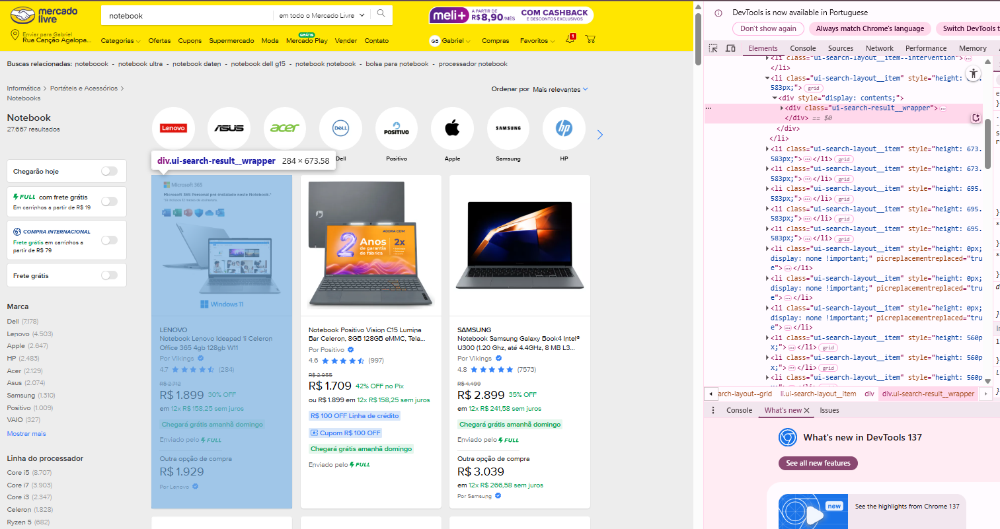
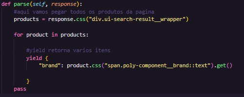
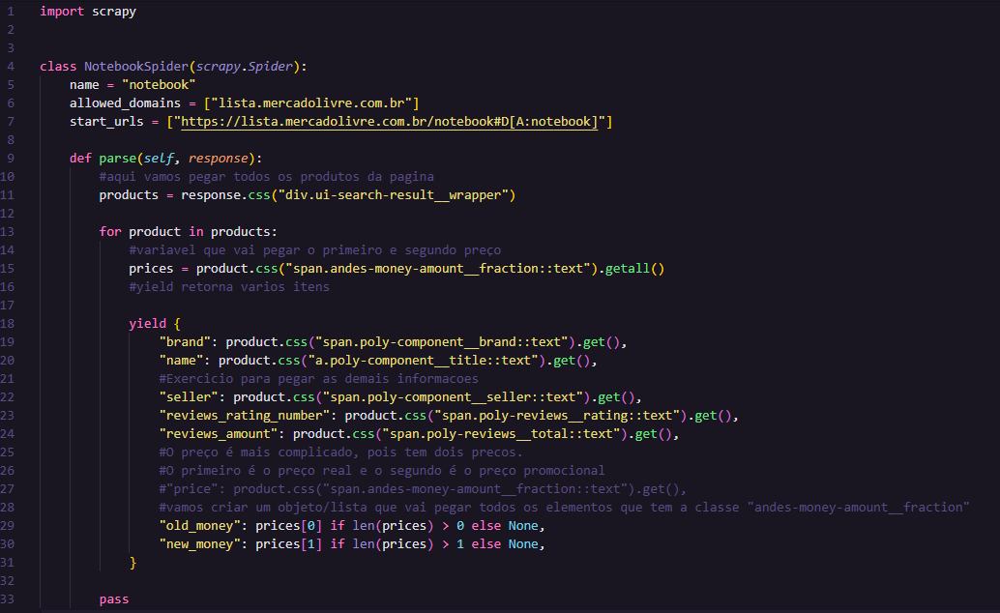

# ProjetoScraping


Ativar o ambiente virtual
- Criar: python -m venv .venv
- Ativar: source .venv/Scripts/Activate

Instalar scrapy. 
pip install scrapy.

Sobre o Scrapy é muito confiavel conhecido como framework.

passos no terminal: 
criar a estrutura de pasta
scrapy startproject coleta. 
Deleta a pipelines por que usamos o pandas para KPI.
Deleta o middlewares, não vamos usar nada complexos. Exemplos: fazer login em sites, fazer capt e etc...

agora vamos criar um spiders, usamos para coletar dados de um site

no terminal: 
````bash
cd coleta
scrapy genspider notebook https://lista.mercadolivre.com.br/notebook#D[A:notebook]
````
Ele cria um notebook para fazer o scrapy
não precisamos usar as class e nem entrar em programação orientada a objeto.

Mostrar a pagina do mercado livre no inspecionar e demonstrar como os elementos fica na tela.
10 minutos para achar os links.

podemos fazer essas requisições direto pelo computador/shell
Usando o scrapt shell

````bash
scrapy shell
````
agora vamos fazer uma requisição para o site.

````bash
fetch('https://lista.mercadolivre.com.br/notebook#D[A:notebook]')
````
retorna um erro 403. 
O mercado livre não quer ninguém atacando o site deles, pode ser algum hack tentando invadir o site.
Uma forma de não ser bloqueado é usar o: user agent.

user agent é um cabeçario que fala da onde o scrapy está indo e o formato que ele pode devolver. 
Ele consegue reconhecer o dispositivo.

Acessa o seu navegador e pesquisa por: 
my user agent 

copia o seu user-agent.

abra o arquivo settings
e procure pelo user-agent. 
Coloque o seu user-agent. 

agora o site acha que é um usuario normal entrando no site.

sai do shell para atualizar e roda o comando novamente. 
````bash
fetch('https://lista.mercadolivre.com.br/notebook#D[A:notebook]')
````
posso pegar os mesmos arquvios com o comando
response.text 

legal, agora vamos para batalha naval? kkkk 
Partiu caça os dados do mercado livre
mostrar como fica os notebooks no inspecionar no mercado livre. 
nas li.
só preciso mapear uma unicar vez o parse

vamos pegar o nome da marca de um dos notebooks para testar. 
achar isso no codigo e a class css que ela pertece. 
rodar no terminal: 
response.css('span.poly-component__brand')
só que assim ele pega um monte de informações a mais e a gente só quer o texto. 
e também não queremos pegar todos os nomes
response.css('span.poly-component__brand::text').get()


podemos verificar todos os itens com: 
response.text

vamos até os site para visualizar esses produtos e sua class css. 


agora vamos até o arquivo notebook em coleta > spidres > notebook.py

vamos atualizar o parse para pegar os produtos


para rodar o codigo e verificar se deu certo
saia do termina shell scrapy com exit()

````bash
scrapy crawl notebook -o data.json 
```` 
-o para salvar o arquivo e o nome na onde vamos salvar esse arquivo.
podemos salvar em csv também

````bash
scrapy crawl notebook -o data.csv
```` 

no arquivo notebook, continue pegando as informações necessarios para nossa analise. 
exercicio para os alunos. 

Podemos usar o Scrapy em qualquer site, alguns dificulta nossa vida... 
Sites que fica mudando as classes css toda hora para evitar essas raspagem de dados.
mas tem formas de pegar isso automatico.

edite o arquivo notebook: 

gere o json ou csv: 
````bash
scrapy crawl notebook -o data.csv
```` 

Agora vamos pensar em como pegar o conteudo da proxima pagina.
mostrar o botão de seguinte para ir para as proximas paginas. 

agora a gente tem o arquivo para trabalhar.

Vamos organizar nossas pastas para trabalhar melhor. 

Agora vamos instalar o pandas, lembrar de sair pasta coleta e ir para pasta raiz do projeto.

pip install pandas

Vamos trabalhar com o pandas agora.
e 
depois o dashboard com streamlit


Rodar o streamlit
````bash
streamlit run app.py
```` 

02:00 